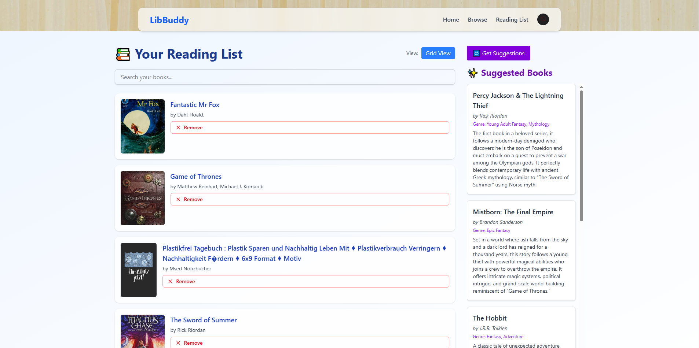

# LibBuddy

LibBuddy is a full-stack web application for book lovers, designed to help users **discover, browse, and manage their reading lists**.  
It integrates the **Open Library API** for book data and the **New York Times Books API** for bestseller tracking, offering a clean, animated, and user-friendly experience.

---

## Table of Contents
- [Features](#features)
- [Tech Stack](#tech-stack)
- [Screenshots](#screenshots)
- [Installation](#installation)
  - [Backend](#backend)
  - [Frontend](#frontend)
- [Usage](#usage)
- [API Overview](#api-overview)
  - [Authentication](#authentication)
  - [Books & Authors](#books--authors)
  - [Reading List](#reading-list-protected--requires-access-token)
  - [Special Features](#special-features)

---

## Features

- 🔐 **User Authentication** (JWT-based with access & refresh tokens)
- 📚 **Browse NYT Bestsellers** and top-rated books in a carousel view
- 🎯 **AI-Powered Recommendations** using Gemini AI
- 📝 **Personalized Reading List**  
  - Add and remove books from search or categories  
- 🔍 **Search & Filter Books** by title, category, year, and ebooks
- 🎨 **Polished UI** with glassmorphism design with Framer Motion animations

---

## Tech Stack
- **Frontend:** React (TypeScript), Tailwind CSS, Framer Motion  
- **Backend:** Node.js + Express (TypeScript)  
- **Database:** PostgreSQL  
- **APIs:** Open Library API, New York Times Books API, Gemini AI API   
- **Other:** Axios, JWT, bcrypt, Vite

---

## Screenshots

Here’s a preview of LibBuddy in action:

  


---

## Installation
> Note: The backend and frontend must be run separately. Start the backend first (`npm run devStart` in `/backend`) and then the frontend (`npm run dev` in `/libbuddy`).
### Backend
1. Clone the repo:
   ```bash
   git clone https://github.com/JohnnyLe507/LibBuddy.git
   ```
2. Navigate to the backend:
   ```bash
    cd backend
    ```
3. Install dependencies:
   ```bash
    npm install
    ```
4. Start the server:
   ```bash
    npm run devStart
    ```
5. Ensure PostgreSQL is running. Then, create a `.env` file in the backend root with the following variables **(replace placeholder values with your actual secrets and credentials):**
   ```bash
    ACCESS_TOKEN_SECRET=your_jwt_access_secret
    REFRESH_TOKEN_SECRET=your_jwt_refresh_secret
    NYT_API_KEY=your_new_york_times_api_key
    GEMINI_API_KEY=your_gemini_api_key
    PG_USER=postgres
    PG_HOST=localhost
    PG_DATABASE=libbuddy
    PG_PASSWORD=your_password_here
    PG_PORT=5432
    ```
### Frontend
1. Head back to the root and navigate to the frontend:
   ```bash
    cd ../libbuddy
    ```
2. Install dependencies:
   ```bash
    npm install
    ```
3. Start the development server:
   ```bash
    npm run dev
    ```
### Usage
- Visit http://localhost:5173 for the frontend.
- Register or log in to start using the reading list.
- Explore categories, NYT bestsellers, and get AI-based suggestions.

### API Overview
Base URL: http://localhost:3000

### Authentication
- **POST `/register`** – Register a new user (name, password)

- **POST `/login`** – Login user and receive access & refresh tokens

- **POST `/token`** – Refresh an expired access token

- **DELETE `/logout`** – Invalidate a refresh token

### Books & Authors
- **GET `/search?q=title`** – Search for books by title (Open Library)

- **GET `/works/:id`** – Get details for a book work

- **GET `/authors/:id`** – Get author details

- **GET `/authors/:id/works`** – Get works by a specific author

- **GET `/subjects/:subject`** – Fetch books by category/genre (supports `offset`, `limit`, `ebooks`, `published_in`)

### Reading List (Protected – requires access token)
- **POST `/add-to-reading-list`** – Add a book to the user’s reading list (`bookId`)

- **GET `/reading-list`** – Fetch the user’s reading list

- **DELETE `/reading-list/:bookId`** – Remove a book from the reading list

### Special Features
- **GET `/bestsellers`** – Fetch New York Times current hardcover fiction list

- **POST `/suggestions`** – Get AI-powered book recommendations (Gemini AI) based on titles
